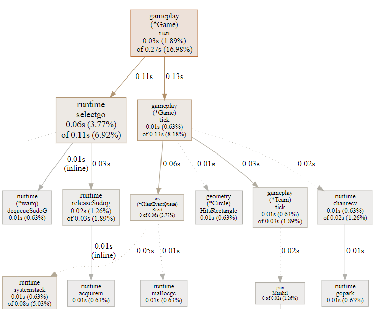

# GoBA - Go Battle Arena

[Try GoBA!](http://goba-env.eba-hiw6diij.ca-central-1.elasticbeanstalk.com/game)

GoBA is a simple multiplayer online battle arena (MOBA) game. The server is written in Go, and the client was built using Typescript and Vue. The game is deployed on AWS using Elastic Beanstalk. The focus of this project is not on gameplay. Instead, it is to see how concurrency features of Go, and websockets can be used to achieve real-time client server communication. GoBA's server is capable of running multiple games at 64 ticks per seconds (TPS) on a single AWS t3nano EC2 instance. This is a great [article](https://technology.riotgames.com/news/valorants-128-tick-servers) by the creators of VALORANT a popular online first person shooter that explains how they were able to achieve 128 TPS and run 3 games on a single CPU core. This is extremely impressive as each frame must be processed in under 2.6 milliseconds.

## Gameplay

The objective of GoBA is to get as many kills as possible until the game automatically ends after 15 minutes. There is an ability to shoot, and an ability to dash. When your character dies you will respawn immediately and the scoreboard will be updated. The scoreboard tracks kills, deaths, and assists. The vision system of GoBA is based on the one in League of Legends. Vision is shared with your teamates meaning anything your team can see you can see. Vision is granted based on line of sight. Walls and bushes obstruct line of sight. If a player is inside of a bush they can see out but other players cannot see in. The projectiles shot by a player also grant vision.

## Next Steps

There were some interesting features I considered adding however, they ended up being outside the current scope of the project:

- Match making system
- Create a more structured game with more characters to play, towers, monst
- Visualize vision on the client with "fog of war". There's an interesting article on how this is done in League of Legends [here](https://technology.riotgames.com/news/story-fog-and-war)
- Implement a path finding algorithm for players to navigate the map automatically. This [article](https://www.researchgate.net/publication/315456384_Applying_Theta_in_Modern_Game) explains a modified version of A\* search algorithm called Theta\* that looks very promising
- Implement various mechanisms to account for latency
