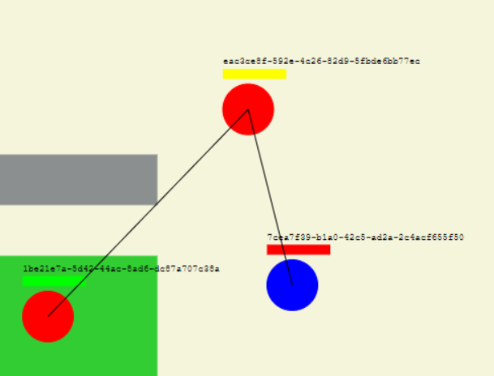
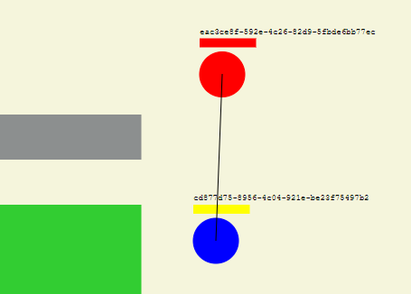
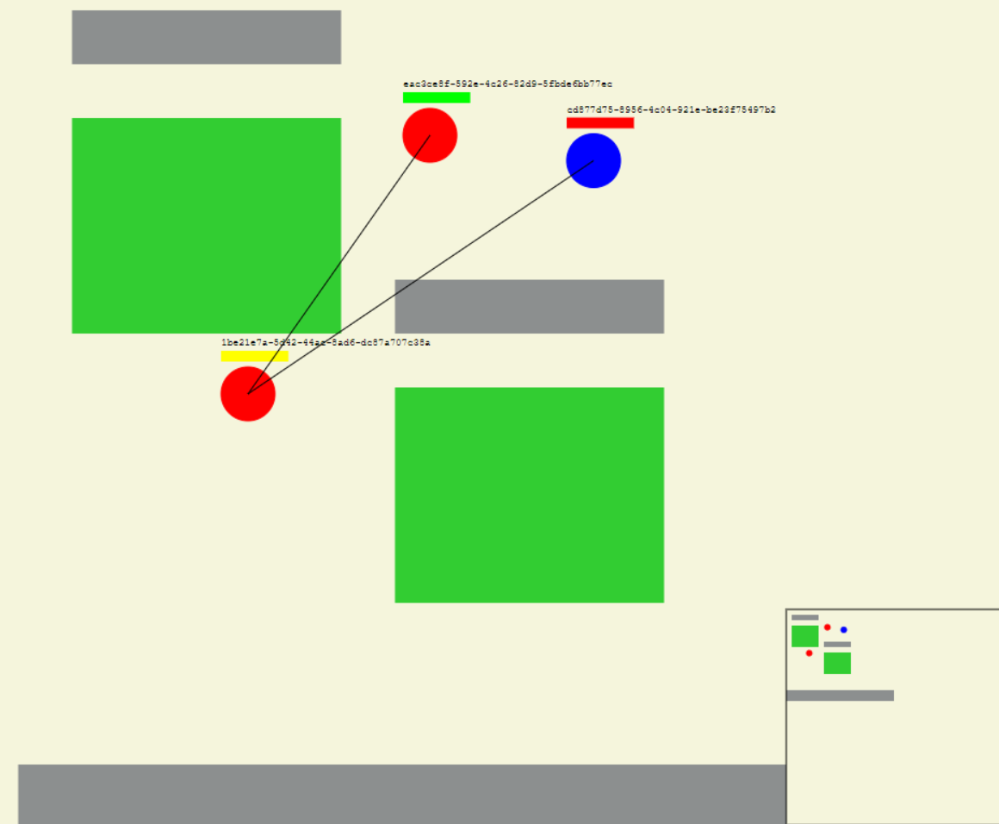

# GoBA

Multiplayer online battle arena (MOBA) game written in Go (GoBA). The goal of this project is to recreate some of the mechanics seen in games like League of Legends and Dota.
The client was written using Typescript, and client to server communication is done using Websockets.

## Vision

In games like League of Legends and Dota their is a vision system to determine what each team can see. The team can see an enemy if at least one of their members has a line of sight to that enemy. Additionally there are bushes that players can step inside of and only be seen if another player enters the bush. This functionality is implemented in GoBA

## Screenshots

- players are shown as circles of their team color
- health bars are shown in yellow for your character, green for allies, red for enemies
- bushes are green
- walls are gray

